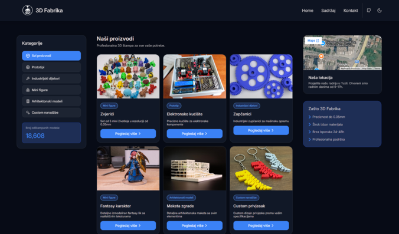

# Grupa46-TPTP-2026
Završni projekat iz Grupe 46 TPTP 2025/2026

## Tema
Portfolio lokalnog poduzetnika — 3D Fabrika, Tuzla

## Opis
Web stranica za lokalnu firmu iz Tuzle koja se bavi profesionalnim 3D printanjem i izradom prototipova po narudžbi.

## Članovi grupe
| Ime i prezime | Username | Zadatak |
|----------|----------|----------|
| Medin Šećić  | @sekikkDev  | Design, JS, dio HTML/CSS  |
| Medina Mustafić  | @mustafic711 | HTML/CSS  |
| Mario Kovačević  | @MarioKovacevicc  | HTML/CSS  |

## Tehnologije
- HTML5
- CSS3 (bez frameworka)
- JavaScript (bez biblioteka)

## AI alati koristeni u projektu
- Claude: za pomoc pri pisanju koda
- ChatGPT: za generisanje slika

## Sajt
Sajt možete pogledati [ovdje.](https://sekikkdev.github.io/Grupa46-TPTP-2026/)

